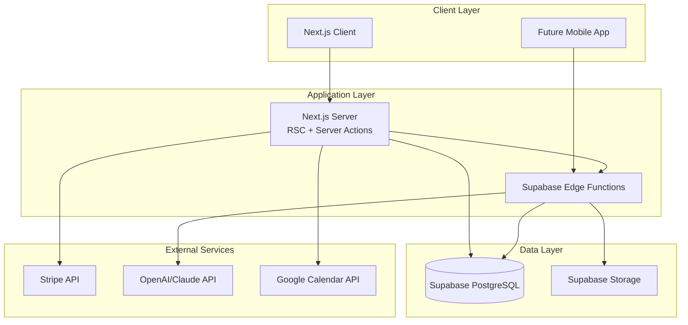
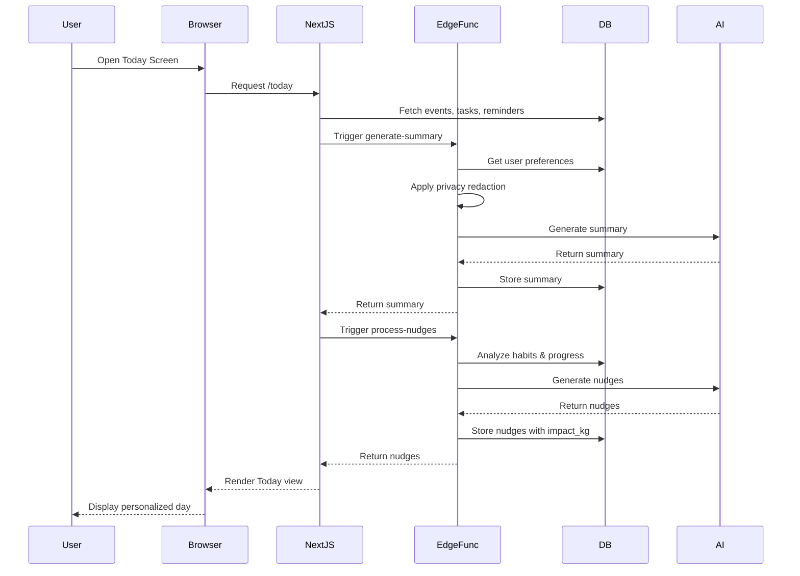
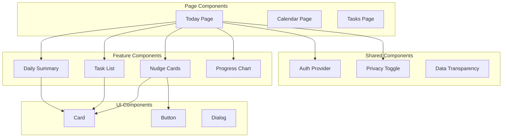
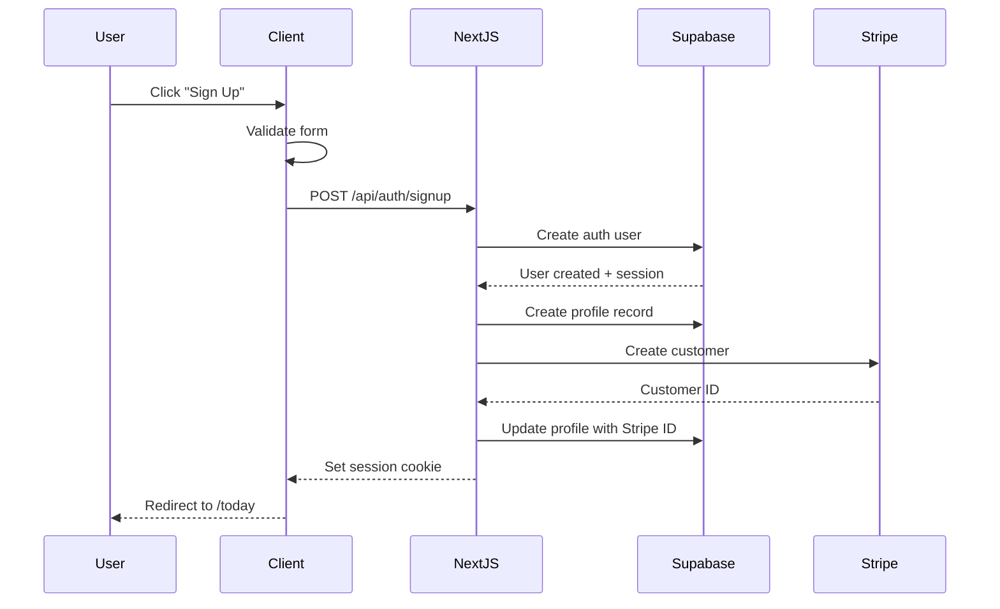
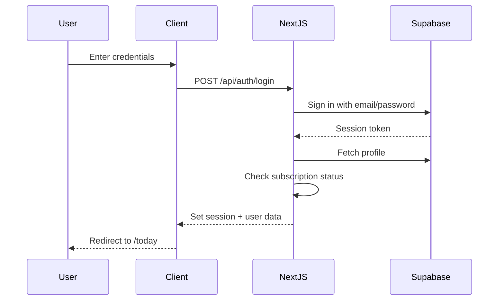

# ClearDay Architecture Reference

## Overview

ClearDay is a privacy-first, AI-powered life organizer built with Next.js 14, Supabase, and Stripe. This document serves as the complete technical blueprint for development.

## 1. File & Folder Structure

```
clearday/
├── app/                          # Next.js App Router
│   ├── (auth)/                   # Auth group routes
│   │   ├── login/
│   │   │   └── page.tsx
│   │   ├── signup/
│   │   │   └── page.tsx
│   │   └── layout.tsx
│   ├── (dashboard)/              # Protected dashboard routes
│   │   ├── today/                # Main Today screen
│   │   │   └── page.tsx
│   │   ├── calendar/
│   │   │   └── page.tsx
│   │   ├── tasks/
│   │   │   └── page.tsx
│   │   ├── habits/
│   │   │   └── page.tsx
│   │   ├── progress/
│   │   │   └── page.tsx
│   │   ├── settings/
│   │   │   ├── privacy/
│   │   │   │   └── page.tsx
│   │   │   ├── integrations/
│   │   │   │   └── page.tsx
│   │   │   ├── household/
│   │   │   │   └── page.tsx
│   │   │   └── page.tsx
│   │   └── layout.tsx
│   ├── api/                      # API Routes
│   │   ├── stripe/
│   │   │   └── webhook/
│   │   │       └── route.ts
│   │   ├── auth/
│   │   │   └── callback/
│   │   │       └── route.ts
│   │   └── cron/
│   │       └── daily-summaries/
│   │           └── route.ts
│   ├── actions/                  # Server Actions
│   │   ├── auth.ts
│   │   ├── tasks.ts
│   │   ├── events.ts
│   │   ├── reminders.ts
│   │   ├── nudges.ts
│   │   ├── habits.ts
│   │   ├── progress.ts
│   │   └── privacy.ts
│   ├── globals.css
│   ├── layout.tsx
│   └── page.tsx                  # Landing page
├── components/                    # React components
│   ├── auth/
│   │   ├── LoginForm.tsx
│   │   ├── SignupForm.tsx
│   │   └── AuthProvider.tsx
│   ├── dashboard/
│   │   ├── TodayView.tsx
│   │   ├── DailySummary.tsx
│   │   ├── TaskList.tsx
│   │   ├── CalendarView.tsx
│   │   └── ProgressChart.tsx
│   ├── privacy/
│   │   ├── PrivacyToggle.tsx
│   │   ├── DataTransparency.tsx
│   │   └── RedactionPreview.tsx
│   ├── nudges/
│   │   ├── NudgeCard.tsx
│   │   ├── ImpactMetrics.tsx
│   │   └── StreakDisplay.tsx
│   ├── ui/                       # shadcn/ui components
│   │   ├── button.tsx
│   │   ├── card.tsx
│   │   ├── dialog.tsx
│   │   ├── input.tsx
│   │   ├── label.tsx
│   │   ├── select.tsx
│   │   ├── switch.tsx
│   │   ├── tabs.tsx
│   │   └── toast.tsx
│   └── layouts/
│       ├── DashboardNav.tsx
│       └── ProtectedRoute.tsx
├── lib/                          # Utilities and configs
│   ├── supabase/
│   │   ├── client.ts
│   │   ├── server.ts
│   │   └── middleware.ts
│   ├── stripe/
│   │   ├── client.ts
│   │   └── server.ts
│   ├── ai/
│   │   ├── llm-client.ts
│   │   ├── prompts.ts
│   │   └── redaction.ts
│   ├── utils/
│   │   ├── dates.ts
│   │   ├── formatting.ts
│   │   └── validation.ts
│   └── hooks/
│       ├── useAuth.ts
│       ├── useSubscription.ts
│       └── usePrivacy.ts
├── types/                        # TypeScript definitions
│   ├── database.ts               # Generated Supabase types
│   ├── api.ts
│   ├── components.ts
│   └── stripe.ts
├── styles/                       # Additional styles
│   └── themes.css
├── public/                       # Static assets
│   ├── images/
│   └── icons/
├── supabase/                     # Supabase project files
│   ├── migrations/               # Database migrations
│   │   ├── 001_initial_schema.sql
│   │   ├── 002_rls_policies.sql
│   │   ├── 003_indexes.sql
│   │   └── 004_feature_flags.sql
│   ├── functions/               # Edge Functions
│   │   ├── generate-summary/
│   │   │   └── index.ts
│   │   ├── process-nudges/
│   │   │   └── index.ts
│   │   ├── adaptive-reminders/
│   │   │   └── index.ts
│   │   ├── privacy-redaction/
│   │   │   └── index.ts
│   │   └── _shared/
│   │       ├── cors.ts
│   │       └── auth.ts
│   └── seed.sql                # Seed data
├── scripts/                     # Build and dev scripts
│   ├── generate-types.ts
│   └── setup-local.ts
├── .env.local                   # Environment variables
├── .env.example
├── next.config.js
├── tailwind.config.ts
├── tsconfig.json
├── package.json
├── architecture.md              # This file
└── README.md
```

### Naming Conventions

- **Folders**: kebab-case (e.g., `auth-provider`, `daily-summaries`)
- **Components**: PascalCase (e.g., `TodayView.tsx`, `PrivacyToggle.tsx`)
- **Utilities/Hooks**: camelCase (e.g., `useAuth.ts`, `formatDate.ts`)
- **Server Actions**: camelCase (e.g., `createTask`, `updateReminder`)
- **Database**: snake_case (e.g., `usage_events`, `co2_kg`)
- **Edge Functions**: kebab-case folders with index.ts entry

## 2. System Architecture

### High-Level Architecture



### Data Flow Architecture



### Component Architecture



### Edge Function Triggers

| Function | Trigger | Purpose | Output |
|----------|---------|---------|--------|
| `generate-summary` | Cron (6am daily) + On-demand | Create AI daily summaries | Personalized day overview |
| `process-nudges` | Event-based + Daily | Generate behavior nudges | Nudges with CO₂ impact |
| `adaptive-reminders` | Event changes + User feedback | Adjust reminder timing | Updated reminder strategies |
| `privacy-redaction` | Before any AI call | Remove PII from data | Redacted data payload |

### State Management Strategy

- **Server State (Primary)**: React Server Components fetch data server-side
- **Client State (Minimal)**: 
  - UI toggles (modals, dropdowns)
  - Optimistic updates for immediate feedback
  - Privacy mode toggle (cached locally)
- **Background Updates**: 
  - Summaries regenerate via cron jobs
  - Reminders update through Edge Functions
  - Progress metrics calculated daily

## 3. Database Schema

### Core Tables

```sql
-- Users and authentication
CREATE TABLE profiles (
    id UUID PRIMARY KEY REFERENCES auth.users(id),
    email TEXT UNIQUE NOT NULL,
    full_name TEXT,
    avatar_url TEXT,
    household_id UUID REFERENCES households(id),
    privacy_mode BOOLEAN DEFAULT false,
    local_mode BOOLEAN DEFAULT false,
    timezone TEXT DEFAULT 'UTC',
    created_at TIMESTAMPTZ DEFAULT NOW(),
    updated_at TIMESTAMPTZ DEFAULT NOW()
);

-- Household management
CREATE TABLE households (
    id UUID PRIMARY KEY DEFAULT gen_random_uuid(),
    name TEXT NOT NULL,
    owner_id UUID REFERENCES profiles(id),
    created_at TIMESTAMPTZ DEFAULT NOW(),
    updated_at TIMESTAMPTZ DEFAULT NOW()
);

-- Integration connections
CREATE TABLE integrations (
    id UUID PRIMARY KEY DEFAULT gen_random_uuid(),
    user_id UUID REFERENCES profiles(id),
    provider TEXT NOT NULL, -- 'google_calendar', 'outlook', etc
    access_token TEXT ENCRYPTED,
    refresh_token TEXT ENCRYPTED,
    token_expiry TIMESTAMPTZ,
    sync_enabled BOOLEAN DEFAULT true,
    last_sync TIMESTAMPTZ,
    settings JSONB DEFAULT '{}',
    created_at TIMESTAMPTZ DEFAULT NOW(),
    updated_at TIMESTAMPTZ DEFAULT NOW()
);

-- Tasks management
CREATE TABLE tasks (
    id UUID PRIMARY KEY DEFAULT gen_random_uuid(),
    user_id UUID REFERENCES profiles(id),
    household_id UUID REFERENCES households(id),
    title TEXT NOT NULL,
    description TEXT,
    due_date DATE,
    due_time TIME,
    completed BOOLEAN DEFAULT false,
    completed_at TIMESTAMPTZ,
    priority INTEGER CHECK (priority IN (1,2,3,4)),
    tags TEXT[],
    recurring_rule JSONB,
    source TEXT, -- 'manual', 'calendar', 'habit'
    created_at TIMESTAMPTZ DEFAULT NOW(),
    updated_at TIMESTAMPTZ DEFAULT NOW()
);

-- Calendar events
CREATE TABLE events (
    id UUID PRIMARY KEY DEFAULT gen_random_uuid(),
    user_id UUID REFERENCES profiles(id),
    integration_id UUID REFERENCES integrations(id),
    external_id TEXT,
    title TEXT NOT NULL,
    description TEXT,
    location TEXT,
    start_time TIMESTAMPTZ NOT NULL,
    end_time TIMESTAMPTZ NOT NULL,
    all_day BOOLEAN DEFAULT false,
    attendees JSONB,
    travel_time INTEGER, -- minutes
    preparation_time INTEGER, -- minutes
    created_at TIMESTAMPTZ DEFAULT NOW(),
    updated_at TIMESTAMPTZ DEFAULT NOW(),
    UNIQUE(integration_id, external_id)
);

-- Adaptive reminders
CREATE TABLE reminders (
    id UUID PRIMARY KEY DEFAULT gen_random_uuid(),
    user_id UUID REFERENCES profiles(id),
    task_id UUID REFERENCES tasks(id),
    event_id UUID REFERENCES events(id),
    type TEXT NOT NULL, -- 'task', 'event', 'habit'
    scheduled_time TIMESTAMPTZ NOT NULL,
    actual_time TIMESTAMPTZ,
    dismissed BOOLEAN DEFAULT false,
    snoozed_until TIMESTAMPTZ,
    personalization_label TEXT, -- 'morning_person', 'deadline_driven', etc
    strategy TEXT, -- 'aggressive', 'gentle', 'smart'
    effectiveness_score DECIMAL(3,2),
    created_at TIMESTAMPTZ DEFAULT NOW(),
    updated_at TIMESTAMPTZ DEFAULT NOW()
);

-- Behavioral nudges
CREATE TABLE nudges (
    id UUID PRIMARY KEY DEFAULT gen_random_uuid(),
    user_id UUID REFERENCES profiles(id),
    type TEXT NOT NULL, -- 'eco', 'health', 'productivity', 'social'
    title TEXT NOT NULL,
    message TEXT NOT NULL,
    action_type TEXT, -- 'task_creation', 'habit_start', 'reminder_set'
    action_data JSONB,
    impact_kg DECIMAL(10,3), -- CO2 savings in kg
    shown_at TIMESTAMPTZ,
    acted_on BOOLEAN DEFAULT false,
    acted_at TIMESTAMPTZ,
    expires_at TIMESTAMPTZ,
    created_at TIMESTAMPTZ DEFAULT NOW()
);

-- Habit tracking
CREATE TABLE habits (
    id UUID PRIMARY KEY DEFAULT gen_random_uuid(),
    user_id UUID REFERENCES profiles(id),
    name TEXT NOT NULL,
    description TEXT,
    frequency TEXT NOT NULL, -- 'daily', 'weekly', 'monthly'
    target_count INTEGER DEFAULT 1,
    current_streak INTEGER DEFAULT 0,
    longest_streak INTEGER DEFAULT 0,
    auto_rules JSONB, -- Automatic detection rules
    reminder_time TIME,
    category TEXT,
    impact_per_completion DECIMAL(10,3), -- CO2 impact
    created_at TIMESTAMPTZ DEFAULT NOW(),
    updated_at TIMESTAMPTZ DEFAULT NOW()
);

-- Purchase tracking
CREATE TABLE purchases (
    id UUID PRIMARY KEY DEFAULT gen_random_uuid(),
    user_id UUID REFERENCES profiles(id),
    stripe_customer_id TEXT,
    stripe_payment_intent_id TEXT UNIQUE,
    product_type TEXT NOT NULL, -- 'lifetime', 'addon_calendar', etc
    amount INTEGER NOT NULL, -- cents
    currency TEXT DEFAULT 'usd',
    status TEXT NOT NULL, -- 'pending', 'completed', 'failed', 'refunded'
    features_unlocked TEXT[],
    created_at TIMESTAMPTZ DEFAULT NOW(),
    updated_at TIMESTAMPTZ DEFAULT NOW()
);

-- Usage analytics
CREATE TABLE usage_events (
    id UUID PRIMARY KEY DEFAULT gen_random_uuid(),
    user_id UUID REFERENCES profiles(id),
    event_type TEXT NOT NULL,
    event_data JSONB,
    privacy_note TEXT, -- Explanation of what was/wasn't tracked
    experiment TEXT, -- A/B test identifier
    session_id TEXT,
    created_at TIMESTAMPTZ DEFAULT NOW()
);

-- Progress tracking
CREATE TABLE progress (
    id UUID PRIMARY KEY DEFAULT gen_random_uuid(),
    user_id UUID REFERENCES profiles(id),
    period_type TEXT NOT NULL, -- 'daily', 'weekly', 'monthly'
    period_start DATE NOT NULL,
    tasks_completed INTEGER DEFAULT 0,
    habits_completed INTEGER DEFAULT 0,
    events_attended INTEGER DEFAULT 0,
    co2_kg DECIMAL(10,3) DEFAULT 0, -- Total CO2 saved
    productivity_score INTEGER,
    wellness_score INTEGER,
    created_at TIMESTAMPTZ DEFAULT NOW(),
    updated_at TIMESTAMPTZ DEFAULT NOW(),
    UNIQUE(user_id, period_type, period_start)
);

-- Feature flags
CREATE TABLE feature_flags (
    id UUID PRIMARY KEY DEFAULT gen_random_uuid(),
    user_id UUID REFERENCES profiles(id),
    feature_key TEXT NOT NULL,
    enabled BOOLEAN DEFAULT false,
    variant TEXT,
    metadata JSONB,
    created_at TIMESTAMPTZ DEFAULT NOW(),
    updated_at TIMESTAMPTZ DEFAULT NOW(),
    UNIQUE(user_id, feature_key)
);
```

### Indexes

```sql
-- Performance indexes
CREATE INDEX idx_tasks_user_date ON tasks(user_id, due_date);
CREATE INDEX idx_tasks_household ON tasks(household_id) WHERE household_id IS NOT NULL;
CREATE INDEX idx_events_user_time ON events(user_id, start_time);
CREATE INDEX idx_reminders_user_scheduled ON reminders(user_id, scheduled_time);
CREATE INDEX idx_nudges_user_expires ON nudges(user_id, expires_at);
CREATE INDEX idx_habits_user ON habits(user_id);
CREATE INDEX idx_progress_user_period ON progress(user_id, period_type, period_start);
CREATE INDEX idx_usage_events_user_type ON usage_events(user_id, event_type);
CREATE INDEX idx_purchases_user ON purchases(user_id);
CREATE INDEX idx_feature_flags_user ON feature_flags(user_id);
```

### Row Level Security (RLS) Policies

```sql
-- Enable RLS on all tables
ALTER TABLE profiles ENABLE ROW LEVEL SECURITY;
ALTER TABLE households ENABLE ROW LEVEL SECURITY;
ALTER TABLE integrations ENABLE ROW LEVEL SECURITY;
ALTER TABLE tasks ENABLE ROW LEVEL SECURITY;
ALTER TABLE events ENABLE ROW LEVEL SECURITY;
ALTER TABLE reminders ENABLE ROW LEVEL SECURITY;
ALTER TABLE nudges ENABLE ROW LEVEL SECURITY;
ALTER TABLE habits ENABLE ROW LEVEL SECURITY;
ALTER TABLE purchases ENABLE ROW LEVEL SECURITY;
ALTER TABLE usage_events ENABLE ROW LEVEL SECURITY;
ALTER TABLE progress ENABLE ROW LEVEL SECURITY;
ALTER TABLE feature_flags ENABLE ROW LEVEL SECURITY;

-- Profiles policies
CREATE POLICY "Users can view own profile" ON profiles
    FOR SELECT USING (auth.uid() = id);

CREATE POLICY "Users can update own profile" ON profiles
    FOR UPDATE USING (auth.uid() = id);

-- Households policies  
CREATE POLICY "Household members can view household" ON households
    FOR SELECT USING (
        owner_id = auth.uid() OR
        id IN (SELECT household_id FROM profiles WHERE id = auth.uid())
    );

CREATE POLICY "Only owner can update household" ON households
    FOR UPDATE USING (owner_id = auth.uid());

-- Tasks policies (with household sharing)
CREATE POLICY "Users can view own and household tasks" ON tasks
    FOR SELECT USING (
        user_id = auth.uid() OR
        household_id IN (SELECT household_id FROM profiles WHERE id = auth.uid())
    );

CREATE POLICY "Users can insert own tasks" ON tasks
    FOR INSERT WITH CHECK (user_id = auth.uid());

CREATE POLICY "Users can update own tasks" ON tasks
    FOR UPDATE USING (user_id = auth.uid());

CREATE POLICY "Users can delete own tasks" ON tasks
    FOR DELETE USING (user_id = auth.uid());

-- Events policies
CREATE POLICY "Users can view own events" ON events
    FOR SELECT USING (user_id = auth.uid());

CREATE POLICY "Users can manage own events" ON events
    FOR ALL USING (user_id = auth.uid());

-- Reminders policies
CREATE POLICY "Users can view own reminders" ON reminders
    FOR SELECT USING (user_id = auth.uid());

CREATE POLICY "Users can manage own reminders" ON reminders
    FOR ALL USING (user_id = auth.uid());

-- Nudges policies
CREATE POLICY "Users can view own nudges" ON nudges
    FOR SELECT USING (user_id = auth.uid());

CREATE POLICY "Users can update own nudges" ON nudges
    FOR UPDATE USING (user_id = auth.uid());

-- Habits policies
CREATE POLICY "Users can manage own habits" ON habits
    FOR ALL USING (user_id = auth.uid());

-- Purchases policies
CREATE POLICY "Users can view own purchases" ON purchases
    FOR SELECT USING (user_id = auth.uid());

-- Usage events policies
CREATE POLICY "Users can insert own events" ON usage_events
    FOR INSERT WITH CHECK (user_id = auth.uid());

-- Progress policies
CREATE POLICY "Users can view own progress" ON progress
    FOR SELECT USING (user_id = auth.uid());

-- Feature flags policies
CREATE POLICY "Users can view own flags" ON feature_flags
    FOR SELECT USING (user_id = auth.uid());
```

## 4. Environment Setup

### Environment Variables

```bash
# .env.local

# Supabase
NEXT_PUBLIC_SUPABASE_URL=https://[PROJECT_ID].supabase.co
NEXT_PUBLIC_SUPABASE_ANON_KEY=eyJ...
SUPABASE_SERVICE_ROLE_KEY=eyJ...
SUPABASE_JWT_SECRET=your-jwt-secret

# Stripe
STRIPE_SECRET_KEY=sk_live_...
STRIPE_WEBHOOK_SECRET=whsec_...
NEXT_PUBLIC_STRIPE_PUBLISHABLE_KEY=pk_live_...

# AI Services
OPENAI_API_KEY=sk-...
ANTHROPIC_API_KEY=sk-ant-...
AI_MODEL=gpt-4-turbo-preview # or claude-3-opus

# Google Calendar Integration
GOOGLE_CLIENT_ID=...
GOOGLE_CLIENT_SECRET=...
GOOGLE_REDIRECT_URI=http://localhost:3000/api/auth/callback

# Application
NEXT_PUBLIC_APP_URL=http://localhost:3000
NEXT_PUBLIC_APP_NAME=ClearDay
CRON_SECRET=your-cron-secret

# Feature Flags
ENABLE_LOCAL_MODE=true
ENABLE_HOUSEHOLD=true
ENABLE_CO2_TRACKING=true

# Analytics (optional)
POSTHOG_API_KEY=...
SENTRY_DSN=...
```

### Package.json

```json
{
  "name": "clearday",
  "version": "1.0.0",
  "private": true,
  "scripts": {
    "dev": "next dev",
    "build": "next build",
    "start": "next start",
    "lint": "next lint",
    "type-check": "tsc --noEmit",
    "generate-types": "supabase gen types typescript --project-id [PROJECT_ID] > ./types/database.ts",
    "db-push": "supabase db push",
    "db-reset": "supabase db reset",
    "edge-deploy": "supabase functions deploy",
    "edge-serve": "supabase functions serve"
  },
  "dependencies": {
    "@hookform/resolvers": "^3.3.4",
    "@radix-ui/react-alert-dialog": "^1.0.5",
    "@radix-ui/react-avatar": "^1.0.4",
    "@radix-ui/react-checkbox": "^1.0.4",
    "@radix-ui/react-dialog": "^1.0.5",
    "@radix-ui/react-dropdown-menu": "^2.0.6",
    "@radix-ui/react-label": "^2.0.2",
    "@radix-ui/react-popover": "^1.0.7",
    "@radix-ui/react-select": "^2.0.0",
    "@radix-ui/react-separator": "^1.0.3",
    "@radix-ui/react-slot": "^1.0.2",
    "@radix-ui/react-switch": "^1.0.3",
    "@radix-ui/react-tabs": "^1.0.4",
    "@radix-ui/react-toast": "^1.1.5",
    "@stripe/stripe-js": "^3.0.0",
    "@supabase/auth-helpers-nextjs": "^0.9.0",
    "@supabase/supabase-js": "^2.39.0",
    "@tanstack/react-query": "^5.17.0",
    "class-variance-authority": "^0.7.0",
    "clsx": "^2.1.0",
    "date-fns": "^3.0.0",
    "framer-motion": "^10.17.0",
    "lucide-react": "^0.309.0",
    "next": "14.1.0",
    "openai": "^4.24.0",
    "react": "^18.2.0",
    "react-dom": "^18.2.0",
    "react-hook-form": "^7.48.0",
    "recharts": "^2.10.0",
    "stripe": "^14.12.0",
    "tailwind-merge": "^2.2.0",
    "tailwindcss-animate": "^1.0.7",
    "zod": "^3.22.4",
    "zustand": "^4.4.7"
  },
  "devDependencies": {
    "@types/node": "^20.10.0",
    "@types/react": "^18.2.0",
    "@types/react-dom": "^18.2.0",
    "@typescript-eslint/eslint-plugin": "^6.16.0",
    "@typescript-eslint/parser": "^6.16.0",
    "autoprefixer": "^10.4.16",
    "eslint": "^8.56.0",
    "eslint-config-next": "14.1.0",
    "postcss": "^8.4.32",
    "prettier": "^3.1.1",
    "prettier-plugin-tailwindcss": "^0.5.9",
    "supabase": "^1.131.0",
    "tailwindcss": "^3.4.0",
    "typescript": "^5.3.3"
  }
}
```

### Supabase Project Configuration

1. **Authentication Settings**:
   - Enable Email/Password authentication
   - Configure Google OAuth (optional)
   - Set up email templates for verification and password reset
   - Configure redirect URLs for production domain

2. **Edge Functions**:
   - Enable Deno runtime
   - Set environment variables for AI keys
   - Configure CORS for your domain
   - Set up scheduled functions for daily summaries

3. **Database**:
   - Enable pgvector extension for future embeddings
   - Configure connection pooling
   - Set up automated backups
   - Enable point-in-time recovery

4. **Storage**:
   - Create buckets for user avatars and attachments
   - Set up public access policies for avatars
   - Configure file size limits (5MB for images)

5. **Security**:
   - Enable RLS on all tables
   - Configure API rate limiting
   - Set up webhook signature verification
   - Enable audit logging

## 5. Authentication Flow

### Sign-up Flow



### Login Flow



### Protected Routes

```typescript
// middleware.ts
export async function middleware(req: NextRequest) {
  const res = NextResponse.next();
  const supabase = createMiddlewareClient({ req, res });
  
  const {
    data: { session },
  } = await supabase.auth.getSession();

  // Protected routes
  const protectedPaths = ['/today', '/calendar', '/tasks', '/settings'];
  const isProtectedPath = protectedPaths.some(path => 
    req.nextUrl.pathname.startsWith(path)
  );

  if (isProtectedPath && !session) {
    return NextResponse.redirect(new URL('/login', req.url));
  }

  return res;
}
```

### Feature Gating

#### Plus Features (Paid)
- **Check Method**: Query `purchases` table for completed lifetime purchase
- **Gated Features**:
  - Google Calendar integration
  - Advanced AI personalization
  - Unlimited nudges and habits
  - CO₂ tracking dashboard
  - Priority support

#### Household Features
- **Check Method**: Profile has non-null `household_id`
- **Permissions**:
  - View shared tasks and events
  - Edit own tasks only
  - Household owner can manage members
  - Shared progress metrics

#### Privacy Modes
- **Local Mode**: All AI requests go through redaction
- **Privacy Mode**: Limited telemetry, no third-party analytics
- **Implementation**:
  ```typescript
  // Check privacy settings
  const { privacy_mode, local_mode } = profile;
  
  if (local_mode) {
    // Redact PII before AI calls
    data = await redactPII(data);
  }
  
  if (privacy_mode) {
    // Skip analytics tracking
    skipAnalytics = true;
  }
  ```

### Session Management

- **Storage**: HTTP-only secure cookies via Supabase Auth
- **Refresh**: Automatic token refresh on API calls
- **Expiry**: 1 week for refresh token, 1 hour for access token
- **Multi-device**: Sessions persist across devices
- **Logout**: Clear all sessions across devices

## Development Workflow

### Getting Started

1. **Clone and Install**:
   ```bash
   git clone [repo]
   cd clearday
   npm install
   ```

2. **Environment Setup**:
   ```bash
   cp .env.example .env.local
   # Fill in all required environment variables
   ```

3. **Database Setup**:
   ```bash
   npx supabase start  # Local development
   npm run db-push     # Apply migrations
   npm run generate-types  # Generate TypeScript types
   ```

4. **Start Development**:
   ```bash
   npm run dev  # Start Next.js
   npx supabase functions serve  # Start edge functions locally
   ```

### Deployment

1. **Production Build**:
   ```bash
   npm run build
   npm run type-check
   npm run lint
   ```

2. **Database Migration**:
   ```bash
   npx supabase db push --project-id [PROD_ID]
   ```

3. **Edge Functions**:
   ```bash
   npm run edge-deploy
   ```

4. **Vercel Deployment**:
   - Connect GitHub repo to Vercel
   - Set environment variables
   - Deploy with automatic previews

## Key Design Decisions

### Privacy-First Architecture
- PII redaction happens at edge before AI calls
- Local Mode for complete privacy
- Transparent data usage displays
- Minimal client-side tracking

### Performance Optimizations
- Server Components for initial page loads
- Streaming for AI responses
- Background job processing
- Database indexing on common queries
- Edge caching for static content

### Scalability Considerations
- Stateless architecture
- Database connection pooling
- Rate limiting on API routes
- Webhook queuing for Stripe events
- CDN for static assets

### Security Measures
- Row Level Security on all tables
- Encrypted tokens in database
- CORS configuration
- Input validation with Zod
- SQL injection prevention via parameterized queries

## Monitoring & Analytics

### Key Metrics
- Daily Active Users (DAU)
- Task completion rates
- Nudge interaction rates
- CO₂ impact totals
- Subscription conversion
- Feature adoption rates

### Error Tracking
- Sentry for exception monitoring
- Supabase logs for database errors
- Vercel logs for function errors
- Custom error boundaries in React

### Performance Monitoring
- Core Web Vitals tracking
- API response times
- Database query performance
- Edge function execution duration

---

This architecture document serves as the single source of truth for ClearDay's technical implementation. Update this document as the system evolves.
